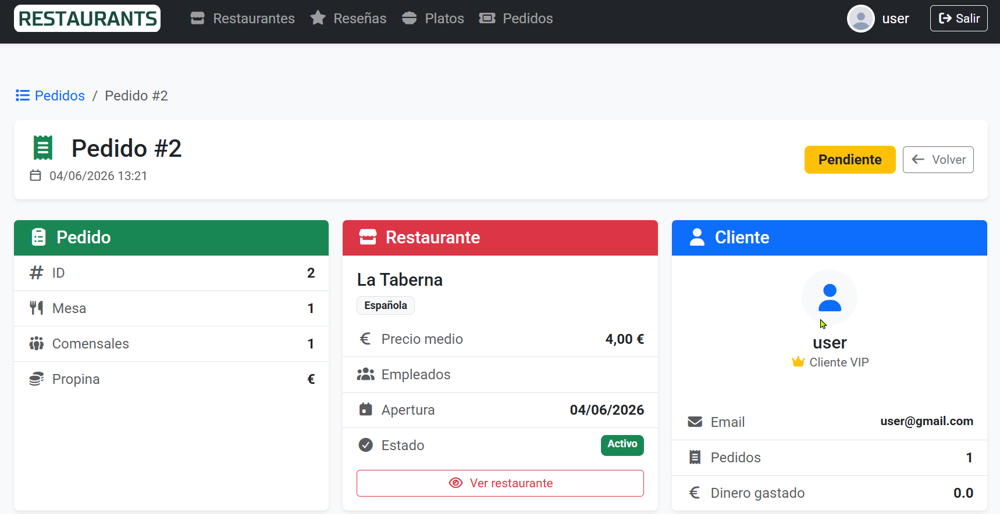

# Restaurantes

> Aplicación web para **descubrir restaurantes, ver sus cartas, dejar reseñas, marcar favoritos y hacer pedidos** — construida con Spring Boot, renderizado en servidor con Thymeleaf y Bootstrap.

<p align="center">
  
  
  
  
  
  
</p>

---

## ¿Qué es?

**Restaurantes** es una aplicación web completa (no una API JSON, sino HTML renderizado en servidor) donde:

- **Cualquier visitante** puede explorar el catálogo de restaurantes y platos, filtrar y leer reseñas.
- **Usuarios registrados** pueden escribir reseñas, marcar favoritos y crear pedidos paso a paso.
- **Administradores** gestionan restaurantes, platos, reseñas y usuarios desde el propio panel.

Todo con autenticación real, control de acceso por roles, subida de imágenes y datos de demo listos para arrancar.

---

## Funcionalidades principales

### Catálogo y descubrimiento
- Listado de restaurantes con **filtros combinables** por tipo de cocina, precio medio y nombre.
- Ficha de cada restaurante con su **carta de platos** y sus **reseñas**.
- Catálogo de platos con ficha individual y reseñas por plato.
- Solo se muestran restaurantes **activos** (borrado lógico, no se pierde el histórico).

### Reseñas y favoritos
- Reseñas con **título, descripción y puntuación de 1 a 5**, validadas en el servidor.
- Marca/desmarca **favoritos** (restaurantes y platos) con un solo clic.
- Los favoritos aparecen destacados en toda la navegación y en tu perfil.

### Pedidos
- Crea un pedido asociado a un restaurante y **añade platos como líneas de pedido**.
- Suma de unidades, **recálculo automático del total** y edición de cantidades.
- Finalización con **datos de pago validados** (número de tarjeta, caducidad, titular, CVV) y propina opcional.
- Estados del pedido: `PENDIENTE -> EN PROGRESO -> FINALIZADO`.

### Cuentas y perfil
- **Registro e inicio de sesión** con Spring Security (contraseñas cifradas con BCrypt).
- Perfil de usuario con **estadísticas**: nº de reseñas, nº de pedidos, dinero gastado y favoritos.
- **Subida de avatar** y de imágenes de restaurantes/platos.

### Panel de administración
- CRUD de **restaurantes** (crear, editar, desactivar) con imagen.
- CRUD de **platos** asignados a su restaurante.
- Gestión de **reseñas** (borrar / moderar).
- Gestión de **usuarios** (alta, edición, roles, activar/desactivar).

---

## Modelo de datos

| Entidad | Descripción |
|--------|-------------|
| **Restaurant** | Restaurante: nombre, precio medio, tipo de cocina, fecha de apertura, estado activo, imagen. |
| **Dish** | Plato: nombre, descripción, precio, tipo (entrante/principal/postre), restaurante e imagen. |
| **Review** | Reseña con puntuación 1-5 sobre un restaurante o un plato. |
| **Order** / **OrderLine** | Pedido y sus líneas (plato + cantidad), con total, estado y datos de pago. |
| **User** | Usuario con rol (`ROLE_USER` / `ROLE_ADMIN`), implementa `UserDetails`. |
| **Favorite** | Relación usuario - restaurante o plato favorito. |
| **Employee** | Empleado asociado a un restaurante. |

---

## Stack tecnológico

- **Java 25** + **Spring Boot 4.0.5**
- **Spring MVC** + **Thymeleaf** (renderizado en servidor, sin SPA ni JS de frameworks)
- **Spring Data JPA** sobre **H2** en memoria (perfiles `dev`/`test`) o **PostgreSQL 18** (perfil `prod`, vía Docker)
- **Spring Security** (login por formulario, roles, BCrypt) + `thymeleaf-extras-springsecurity6`
- **Spring Validation** (Jakarta Bean Validation) para formularios
- **Bootstrap 5.3** + **Font Awesome 7** vía WebJars
- **Lombok** para reducir boilerplate
- **GitHub Actions** para compilación en CI

### Detalles de diseño que merece la pena destacar
- **Borrado lógico** de restaurantes (`active`) en lugar de borrado físico.
- **Datos globales en la navbar** mediante `@ControllerAdvice` + `@ModelAttribute` (favoritos disponibles en cualquier vista sin repetir código).
- **Páginas de error personalizadas** (403, 404, 500).
- **Subida de archivos** al directorio `uploads/`, servido como recurso estático.
- **Datos de demo** cargados al arrancar desde `config/DataInitializer` (de forma idempotente).

---

## Cómo arrancarlo en local

> Requisitos: **JDK 25**. El proyecto incluye el *wrapper* de Maven (no hace falta instalar Maven).
> Para usar **PostgreSQL** necesitas además **Docker**; para **H2** no hace falta nada más. Si no tienes
> Docker, mira [DOCKER.md](DOCKER.md).

```bash
# Clona el repositorio
git clone https://github.com/<tu-usuario>/restaurantes-java.git
cd restaurantes-java
```

### Bases de datos y perfiles

La app elige la base de datos según el **perfil de Spring** activo:

| Perfil | Base de datos | ¿Docker? | Para qué |
|--------|---------------|:--------:|----------|
| `dev` (por defecto) | **H2** en memoria | No | Desarrollo del día a día. |
| `prod` | **PostgreSQL 18** (Docker Compose) | Sí | Ejecutar la app como en producción. |
| `test` | **H2** en memoria | No | Tests automáticos (se activa solo al testear). |

El perfil por defecto es `dev`, fijado con `spring.profiles.default=dev` en `application.properties`. No se fuerza ningún perfil activo: `prod` se activa **desde fuera** (ver Opción B). Los tests corren en **H2** y **no necesitan Docker**.

### Opción A: H2 en memoria (por defecto, sin Docker)

```bash
./mvnw spring-boot:run        # Linux / macOS
mvnw.cmd spring-boot:run      # Windows
```

Luego abre http://localhost:8080

- Consola H2: http://localhost:8080/h2-console — JDBC URL `jdbc:h2:mem:restaurantes_db`, usuario `sa`, contraseña vacía.
- La BD es **en memoria**: los datos se reinician en cada arranque y se recargan los de demo.

### Opción B: PostgreSQL (perfil `prod`, requiere Docker)

> **Hay que arrancar PostgreSQL A MANO antes que la app.** La aplicación **no** levanta la base de datos sola.

```bash
# 1) Arranca PostgreSQL con Docker Compose (desde la carpeta del proyecto, donde está compose.yaml)
docker compose up -d

# 2) Arranca la app con el perfil prod
./mvnw spring-boot:run -Dspring-boot.run.profiles=prod
#    PowerShell: entrecomilla ->  ./mvnw spring-boot:run "-Dspring-boot.run.profiles=prod"
#    IntelliJ:   Edit Configurations > Modify options > Active profiles > prod

# 3) Para la base de datos al terminar
docker compose down       # para la BD y CONSERVA los datos
docker compose down -v    # para la BD y BORRA los datos
```

Datos de conexión (definidos en `compose.yaml`): base `restaurantes`, usuario `restaurantes`, contraseña `restaurantes`, puerto `5432`.

> **Datos de demo en PostgreSQL.** Al arrancar, `DataInitializer` siembra los datos de demo **solo si la base de datos está vacía** (es idempotente). Por eso puedes arrancar y reiniciar la app en perfil `prod` cuantas veces quieras sin que se dupliquen los datos ni falle. Si quieres regenerar los datos desde cero, borra el volumen: `docker compose down -v && docker compose up -d`.

### Cuentas de demo

| Usuario | Contraseña | Rol |
|---------|-----------|-----|
| `admin` | `admin`   | Administrador (acceso total) |
| `user`  | `user`    | Usuario estándar |

---

## Permisos por rol (resumen)

| Acción | Visitante | Usuario | Admin |
|--------|:--------:|:-------:|:-----:|
| Ver restaurantes, platos y reseñas | Sí | Sí | Sí |
| Escribir reseñas | No | Sí | Sí |
| Crear y gestionar pedidos | No | Sí | Sí |
| Marcar favoritos | No | Sí | Sí |
| Crear/editar/desactivar restaurantes y platos | No | No | Sí |
| Moderar reseñas y gestionar usuarios | No | No | Sí |

---

## Estructura del proyecto

```
src/main/java/com/restaurantes
├── config/        # Seguridad, recursos web y carga de datos demo (DataInitializer)
├── controller/    # Controladores MVC (restaurantes, platos, pedidos, reseñas, usuarios, auth)
├── dto/           # Objetos de transferencia (formularios, estadísticas)
├── model/         # Entidades JPA y enums del dominio
├── repository/    # Repositorios Spring Data JPA
└── service/       # Lógica de negocio (usuarios, favoritos, ficheros)

src/main/resources
├── templates/     # Vistas Thymeleaf (layout, restaurantes, platos, pedidos, reseñas, auth, error)
├── application.properties        # común + perfil por defecto (dev)
├── application-dev.properties    # H2 en memoria
└── application-prod.properties   # PostgreSQL
```

Los datos de demo se cargan al arrancar desde `config/DataInitializer`. El `main()` solo arranca Spring; no contiene lógica de creación de datos.

---

## Posibles mejoras futuras

- Exponer una **API REST** además de las vistas Thymeleaf.
- **Migraciones de esquema** (Flyway/Liquibase) para el perfil PostgreSQL.
- Búsqueda y paginación avanzadas del catálogo.
- Notificaciones de estado de pedido.

---

## Capturas



---

<p align="center">
  Hecho con Java y Spring Boot
</p>
